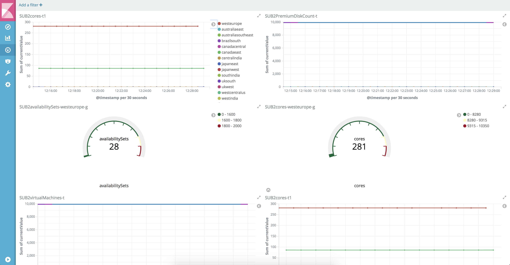
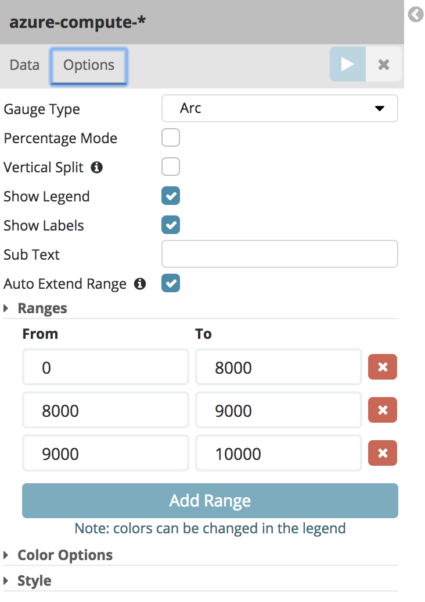
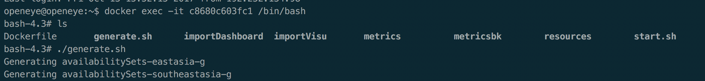
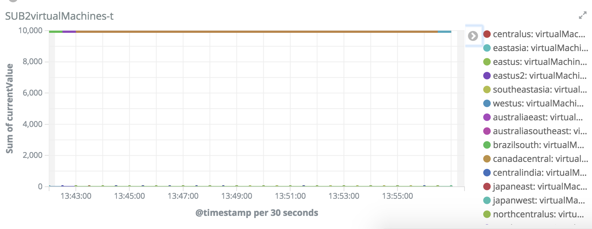

## Azure watcher metrics to ELK

This code allows you to send data from an Azure Subscription to LogStash. 

For example, you can watch the core(s) consumption, or the number of VMs, storage account, VMSS and more deployed...




## Architecture

Per default, this container will run the `start.sh` file. This one, will call all the files included in the `metrics` folder.

As you can see, per default, this foler is containing the `computelimit.sh` as example.

The concept is to send a JSON payload to logstash using curl.

>The metrics folder can contain multiple files, see the metricsExamples folder.

## Variables

When you start your container you have to specify few environement variables such as :


| Name | Description | Mandatory | Default |
|----|-----|-----|-----|-----
| AZURE_CLIENT_ID | Azure Client ID | Yes | - |
| AZURE_CLIENT_SECRET | Azure Client Secret | Yes | - |
| AZURE_TENANT_ID | Azure Tenant ID | Yes | - |
| AZURE_SUBSCRIPTION_ID | Azure Subscription ID | Yes | - |
| LOGSTASHSERVER | LogStash server to send to the metrics | Yes | - |
| LOGSTASHPORT| LogStash port to send the metrics | Yes | - |
| TIMER | Time to wait between two requests. Warning ! This could | No | 300 | - |
| GENERATE | See bellow | No| No | - |
| PREFIX | See bellow | No | "" | - |


> Warning ! The value of TIMER can influence the size of your ElasticSearch Backend

> If you are not familiar with the variables `AZURE_CLIENT_ID` `AZURE_CLIENT_SECRET` `AZURE_TENANT_ID` and `AZURE_SUBSCRIPTION_ID` you should read some documentation on Azure SPN and how you can use it.


### GENERATE and PREFIX variables

The `generate` variable will allow you to generate all the visualizations in your Kibana instance.

The `generate` value could be either `yes` or `no`

This command will monitore the following resources and limits :
- availabilitySets
- cores
- virtualMachines
- virtualMachineScaleSets
- basicAFamily
- standardA0_A7Family
- standardA8_A11Family
- standardDFamily
- standardDv2Family
- standardGFamily
- standardDSFamily
- standardDSv2Family
- standardGSFamily
- standardFFamily
- standardFSFamily
- standardNVFamily
- standardNCFamily
- standardHFamily
- standardAv2Family
- standardLSFamily
- standardDv2PromoFamily
- standardDSv2PromoFamily
- standardMSFamily
- standardDv3Family
- standardDSv3Family
- standardEv3Family
- standardESv3Family
- standardBFamily
- standardFSv2Family
- standardNDFamily
- standardNCv2Family
- StandardDiskCount
- PremiumDiskCount

> You can check those value by running this command : `az vm list-usage -l eastus --query '[*].[name.value,limit]' -o tsv`

This will create one Gauge Visu per resources X per Region :
- StandardDiskCount-japanwest-g
- StandardDiskCount-japaneast-g
- StandardDiskCount-brazilsouth-g
- StandardDiskCount-australiaeast-g
- StandardDiskCount-australiasoutheast-g
- ...
- virtualMachines-brazilsouth-g
- virtualMachines-australiaeast-g
- virtualMachines-australiasoutheast-g
- ...

> Each values is created dynamicly depending your limits allowed in your subscription. For example, for the core(s) :

If you run the `az vm list-usage -l eastus` you will see your limitation, such as :
```json
{
    "currentValue": "0",
    "limit": "10000",
    "localName": "Total Regional Cores",
    "name": {
      "localizedValue": "Total Regional Cores",
      "value": "cores"
    }
  },
```
The script will set the ranges automatically :
* Minimum to 0
* Maximum to limit
* 80% and 90% of the limit for the middle ranges



It is a one shot process, so the recomandation is to run that one on the side of your cluster using the docker cli (docker run or exec).

``` bash
# Example using docker run
$ docker run -it --rm -e AZURE_CLIENT_ID="XXXXXXX" -e AZURE_CLIENT_SECRET="XXXXXXX" -e AZURE_TENANT_ID="XXXXXXX" -e AZURE_SUBSCRIPTION_ID="XXXXXXX" -e LOGSTASHSERVER=logstash -e LOGSTASHPORT=5000 -e TIMER=500 -e GENERATE=yes -e PREFIX=MySub
```



The script will also create one line chart per resources (ex: virtualMachines-t), to visualize all the regions together with the Max Value



> All the visualization finishing with `-t` is a timeserie visu. All finishing with `-g` is a gauge.

The `prefix` value allow you to specify a prefix on the name of your visualization, in case you have multiple subscriptions to monitore.


# Example running with the Docker-ELK project and multiple subscription

Here a example of a complex setup using the [docker-elk](https://github.com/deviantony/docker-elk) github project.

In this example we :
- Monitoring 4 Azure Subscription
- Every minutes (Consuming a lot of storage and resources)
- Parsing and transforming value in logstash
- Using the curl plugin in logstash


Contain of the `docker-compose.yml` file :

``` yaml
version: '2'

services:

  elasticsearch:
    build: elasticsearch/
    volumes:
      - ./elasticsearch/config/elasticsearch.yml:/usr/share/elasticsearch/config/elasticsearch.yml
    ports:
      - "9200:9200"
      - "9300:9300"
    environment:
      ES_JAVA_OPTS: "-Xmx256m -Xms256m"
    networks:
      - elk

  logstashops:
    build: logstash/
    volumes:
      - ./logstash/config/logstash.yml:/usr/share/logstash/config/logstash.yml
      - ./logstash/config/pipelines.yml:/usr/share/logstash/config/pipelines.yml
      - ./logstash/pipeline:/usr/share/logstash/pipeline
    ports:
      - "5000:5000"
      - "5001:5001"
    environment:
      LS_JAVA_OPTS: "-Xmx256m -Xms256m"
    networks:
      - elk
    depends_on:
      - elasticsearch

  logstashsub1:
    build: logstash/
    volumes:
      - ./logstash/config/logstash.yml:/usr/share/logstash/config/logstash.yml
      - ./logstash/config/pipelines.yml:/usr/share/logstash/config/pipelines.yml
      - ./logstash/pipeline:/usr/share/logstash/pipeline
    ports:
      - "5011:5001"
    environment:
      LS_JAVA_OPTS: "-Xmx256m -Xms256m"
    networks:
      - elk
    depends_on:
      - elasticsearch

  logstashsub2:
    build: logstash/
    volumes:
      - ./logstash/config/logstash.yml:/usr/share/logstash/config/logstash.yml
      - ./logstash/config/pipelines.yml:/usr/share/logstash/config/pipelines.yml
      - ./logstash/pipeline:/usr/share/logstash/pipeline
    ports:
      - "5012:5001"
    environment:
      LS_JAVA_OPTS: "-Xmx256m -Xms256m"
    networks:
      - elk
    depends_on:
      - elasticsearch

  logstashsub3:
    build: logstash/
    volumes:
      - ./logstash/config/logstash.yml:/usr/share/logstash/config/logstash.yml
      - ./logstash/config/pipelines.yml:/usr/share/logstash/config/pipelines.yml
      - ./logstash/pipeline:/usr/share/logstash/pipeline
    ports:
      - "5013:5001"
    environment:
      LS_JAVA_OPTS: "-Xmx256m -Xms256m"
    networks:
      - elk
    depends_on:
      - elasticsearch

  kibana:
    build: kibana/
    volumes:
      - ./kibana/config/:/usr/share/kibana/config
    ports:
      - "5601:5601"
    networks:
      - elk
    depends_on:
      - elasticsearch

  azurelogsops:
    build: azurelogs/
    environment:
      AZURE_CLIENT_ID: "XXXXXXXXXXXXX"
      AZURE_CLIENT_SECRET: "XXXXXXXXXXXXX"
      AZURE_TENANT_ID: "XXXXXXXXXXXXX"
      AZURE_SUBSCRIPTION_ID: "XXXXXXXXXXXXX"
      LOGSTASHSERVER: "logstashops"
      LOGSTASHPORT: 5001
      TIMER: 60
      GENERATE: "False"
      PREFIX: "OPS"
    networks:
      - elk
    depends_on:
      - logstashops

  azurelogssub1:
    build: azurelogs/
    environment:
      AZURE_CLIENT_ID: "XXXXXXXXXXXXX"
      AZURE_CLIENT_SECRET: "XXXXXXXXXXXXX"
      AZURE_TENANT_ID: "XXXXXXXXXXXXX"
      AZURE_SUBSCRIPTION_ID: "XXXXXXXXXXXXX"
      LOGSTASHSERVER: "logstashsub1"
      LOGSTASHPORT: 5001
      TIMER: 60
      GENERATE: "False"
      PREFIX: "SUB1"
    networks:
      - elk
    depends_on:
      - logstashsub1

  azurelogssub2:
    build: azurelogs/
    environment:
      AZURE_CLIENT_ID: "XXXXXXXXXXXXX"
      AZURE_CLIENT_SECRET: "XXXXXXXXXXXXX"
      AZURE_TENANT_ID: "XXXXXXXXXXXXX"
      AZURE_SUBSCRIPTION_ID: "XXXXXXXXXXXXX"
      LOGSTASHSERVER: "logstashsub2"
      LOGSTASHPORT: 5001
      TIMER: 60
      GENERATE: "False"
      PREFIX: "SUB2"
    networks:
      - elk
    depends_on:
      - logstashsub2

  azurelogssub3:
    build: azurelogs/
    environment:
      AZURE_CLIENT_ID: "XXXXXXXXXXXXX"
      AZURE_CLIENT_SECRET: "XXXXXXXXXXXXX"
      AZURE_TENANT_ID: "XXXXXXXXXXXXX"
      AZURE_SUBSCRIPTION_ID: "XXXXXXXXXXXXX"
      LOGSTASHSERVER: "logstashsub3"
      LOGSTASHPORT: 5001
      TIMER: 60
      GENERATE: "False"
      PREFIX: "SUB3"
    networks:
      - elk
    depends_on:
      - logstashsub3

networks:

  elk:
    driver: bridge


```


Contain of the `logstash.conf` file (logstash pipeline):
```
input {
	http {
		host => "0.0.0.0"
		port => 5001
		codec => json
	}
}

## Add your filters / logstash plugins configuration here

filter {
  mutate {
    convert => { "currentValue" => "integer" }
	convert => { "limit" => "integer" }
  }
}

output {
	elasticsearch {
		hosts => "elasticsearch:9200"
		index => "azure-compute-%{+YYYY.MM.dd}"
	}
}
```